# User manual

This manual explains what the Universal Agent Workflow is, when it earns its cost, and how the pieces fit together. [README.md](README.md) is the installation and command reference; start here. [GUIDE.ar.md](GUIDE.ar.md) covers the same ground in Arabic.

### The short version

```shell
python scripts/install_workflow.py ../your-project   # run this from this repository
cd ../your-project
python .agent/workflow.py setup --ask                # fills what the repo proves, asks you the rest
```

`setup` fills `.agent/PROJECT.md` and `.agent/COMMANDS.md` with everything the repository can prove, each value followed by its evidence, and `--ask` asks you the few questions no file can answer. Run each command in `COMMANDS.md` once before trusting it. Open the project in an agent tool that reads `AGENTS.md` and ask for work in plain language — that is the whole daily usage.

Nothing else here is mandatory. Section 2 says which parts are worth turning on, and section 3 covers onboarding in full, including a repository with no code yet.

---

## 1. What this actually is

It is a **filing system for the facts an agent needs, plus gates that check the agent's work.**

Nothing more mysterious than that. It installs a `.agent/` directory into your repository and a small Python CLI that reads it. The directory holds things a coding agent cannot infer from source code: what the product is for, which commands are known to work, which requirements were approved and by whom, which architectural boundaries must hold, and what was learned during past work.

It is **not**:

- an AI model, an agent, or a prompt library
- a build system, test runner, or linter
- a replacement for your issue tracker
- something that writes code for you

It stores facts and enforces rules. Your agent reads the facts. CI enforces the rules.

### The problem it solves

A coding agent starting a task in a large repository has two bad options:

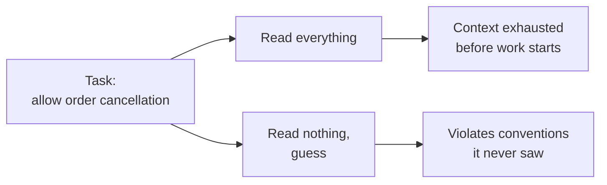

Neither works. The workflow adds a third option: **ask which facts this path needs, load only those.**

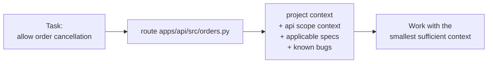

The same routing answers a second question CI cares about: *if this path changed, what else is affected and what must be re-verified?*

---

## 2. When to use it — and when not to

**The unit of adoption is a level, not the whole workflow.** Turning it on is not one decision, and project size is the wrong question to ask. Ask per level, and let the driver decide.

| Level | Turn it on when | Cost |
|---|---|---|
| **1. Facts** — `PROJECT.md`, `COMMANDS.md`, `DECISIONS.md` | You will start more than one agent session on this repo | One `setup --ask` and a few answers, then one line whenever a real decision is made |
| **2. Scopes** — `create-scope`, `route`, `impact` | The repo has more than one bounded area | ~10 minutes per scope |
| **3. Boundaries** — `architecture.json` in CI | Code lands faster than you review it, and the structure is drifting | ~20 minutes for the two or three boundaries you actually care about |
| **4. Specs** — `create-spec`, lifecycle, traceability | Someone other than you must approve or audit what was built | Real, ongoing ceremony |

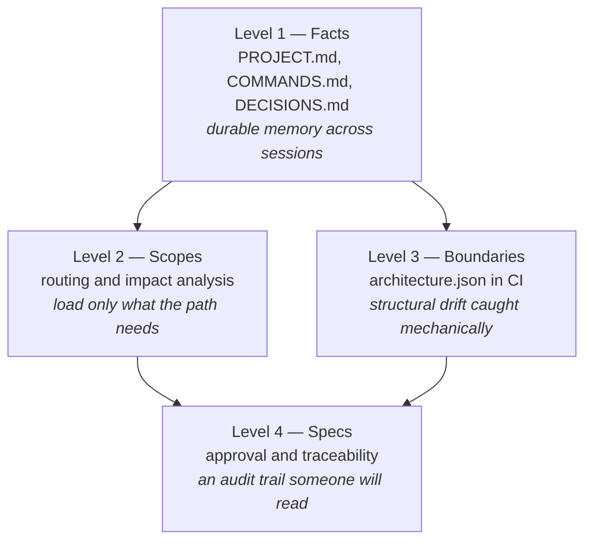

Levels 2 and 3 are independent of each other — boundary checks do not need scopes, and scopes do not need boundary rules. Only Level 4 assumes the rest.

### Solo projects and vibe coding

A fair objection: does any of this apply when it is just you and an agent on a small app?

**For Levels 1 and 3, yes — more than for a large team.** For Level 4, no.

Vibe coding means the agent writes most of the code and you review a fraction of it. Its characteristic failures are precisely what Level 1 exists to prevent:

| What actually goes wrong | What prevents it |
|---|---|
| Session 6 contradicts session 2, because the reasoning lived in a conversation that is gone | `DECISIONS.md` |
| The agent runs `npm test` in a pnpm repo, or invents a build command that never existed | `COMMANDS.md` |
| You retype "this is an X app for Y users, the API is in Z" at the start of every session | `PROJECT.md` |
| One file quietly reaches 900 lines and three responsibilities, because nothing ever objected | `architecture.json` + `check-architecture` |

A team has a human backstop: somebody remembers why. A solo, agent-written repository has no such memory — the only memory is what you wrote down. That makes durable facts **more** valuable here, not less, and Level 1 costs a couple of minutes.

The whole recipe:

```shell
python scripts/install_workflow.py ../my-app
cd ../my-app
python .agent/workflow.py setup --ask
# Answer the questions, run each command in .agent/COMMANDS.md once. That is the entire job.
```

Ignore `specs/`, `findings/`, and `requirements/`. They stay empty, cost nothing, and `validate` does not require them. Add `architecture.json` modules the first time you notice the structure sliding — usually around the point where you stop being able to hold the layout in your head.

### When to genuinely skip all of it

Not "the repo is small" — the real criteria are:

- **One session and done.** A throwaway script, a spike you will not reopen. There is no second session to inform.
- **You will not keep the facts truthful.** A `COMMANDS.md` listing a command that no longer works is worse than an empty one, because the agent trusts it. If you will not maintain it, do not create it.
- **The README already does this job** and the agent actually reads it.

Level 4 has its own, stricter bar. Use specs for work with real consequences — money, safety, privacy, public contracts, regulated behaviour — not for every change. If nobody will ever ask "who approved this and what proves it works", specs are pure overhead.

---

## 3. Onboarding: how the agent learns the project

Installing the workflow creates **scaffolding, not knowledge**. A fresh `.agent/PROJECT.md` says `TODO` on every line, `COMMANDS.md` has an empty table, and `architecture.json` declares no modules. An agent that opens the repository at that moment learns nothing it could not already see.

This is deliberate. A wrong command in `COMMANDS.md` is worse than an empty row, because the agent trusts it. So the framework refuses to invent facts — but it collects the evidence for you and writes down everything the evidence proves.

### `setup` — the whole onboarding in one command

```shell
python .agent/workflow.py setup --ask
```

`setup` runs `bootstrap`, then `adopt`, then builds the index, links other agent tools, and finishes with `doctor`. `--ask` then asks for each field still `TODO` — press Enter to skip one, or type `unknown`. Leave `--ask` off when an agent runs it. Every step is safe to repeat.

### `bootstrap` — evidence, not facts

```shell
python .agent/workflow.py bootstrap
```

It reads the repository and writes exactly one file, `.agent/ONBOARDING.md`. It never writes `PROJECT.md`, `COMMANDS.md`, `scopes.json`, or `architecture.json`, and it never runs a command to find out whether it works.

| It reads | To suggest |
|---|---|
| Manifests and lockfiles | Ecosystems, package manager, which technology profiles apply |
| `package.json` scripts, Makefile targets, solution files, Python manifests | Candidate rows for `COMMANDS.md` |
| Dependencies, SDKs, runtime pins, `README.md`, deployment files, directory layout | Facts for `PROJECT.md`: purpose, system shape, paths, services, deployment, versions |
| CI workflow files | The same, but proven to run somewhere |
| Directories owning their own manifest | Candidate scopes and architecture modules |
| Existing `CLAUDE.md`, `GEMINI.md`, Copilot and Cursor files | Instructions to reconcile rather than duplicate |

Every candidate carries its evidence and a confidence label:

| Label | Means | Trust |
|---|---|---|
| `ci` | Appears in a CI pipeline in this repository | Strongest — something ran it |
| `declared` | Declared in a manifest in this repository | It exists; nobody proved it passes |
| `documented` | Stated in the repository's own README | Only as current as the README |
| `observed` | Seen in the repository's files and directories | It is there today |
| `derived` | Inferred from ecosystem convention only | Most likely to be wrong |

Nothing is ever labelled *verified*. Verification means running it, and that is your step, or your agent's.

### `adopt` — write down what the evidence proves

```shell
python .agent/workflow.py adopt
```

`adopt` writes every `ci`, `declared`, `documented`, and `observed` suggestion into the matching `PROJECT.md` field or `COMMANDS.md` row — but only where the value is still `TODO`. A value someone already wrote is never replaced, so it is safe to re-run after the repository changes. Each value is followed by its evidence, operations nothing declares become `not declared`, and `derived` commands stay `TODO` for a person. Tune the accepted labels with `adopt_confidence` in `.agent/config/onboarding.json`.

Suggested architecture modules always ship `"may_depend_on": []`. The allowed direction of a dependency is a design decision; a scan can see the folders, never the intent.

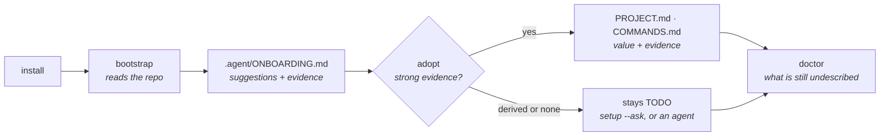

### Scenario: an existing repository

The common case, and the one where a scan pays for itself.

```shell
python scripts/install_workflow.py ../your-project
cd ../your-project
python .agent/workflow.py setup --ask
```

Then run each command in `COMMANDS.md` once, or hand the prompt printed at the end of `.agent/ONBOARDING.md` to an agent: it runs the commands, answers the remaining `TODO` fields from files, and asks you for the rest. That table is the one an agent will trust blindly for months.

Do not declare every scope the scan suggests. Level 1 is the whole job on day one; scopes come when routing actually differs.

### Scenario: a repository with no code yet

Bootstrap reports `mode: greenfield` and stops suggesting, because there is no evidence to read. The order of work inverts:

| Existing repository | Greenfield |
|---|---|
| Extract facts from code | Declare intent before code |
| `COMMANDS.md` from what the repo already runs | `COMMANDS.md` after the first successful build |
| Architecture rules retrofitted onto what exists | Architecture rules written while the folders are still empty |
| Specs when someone must approve | Specs first — you are writing the intent anyway |

Declaring boundaries in `architecture.json` costs minutes on an empty repository and prevents the drift that is expensive to unwind later. It is the highest-value thing you can do on day one, and the only moment it is nearly free. Re-run `bootstrap --force` once code exists.

### Scenario: a monorepo

The scan treats any directory owning a manifest as a candidate scope, so `apps/*` and `packages/*` come back separately, each with its own commands. Give the ones you keep their own verification and dependencies:

```shell
python .agent/workflow.py create-scope api --title "Public API" --kind application --path apps/api --verify "tests=pnpm --filter api test"
python .agent/workflow.py create-scope web --title "Web" --kind application --path apps/web --depends-on api
```

`impact` then expands a change to its downstream consumers and returns only the verification that change requires.

### Scenario: the repository already has agent instructions

The installer stops rather than replacing an existing `AGENTS.md` or `.agent/`. Install into a scratch directory, then merge by hand. Bootstrap lists the entry-point files it found — reconcile them with `AGENTS.md` instead of leaving two sources of truth, and run `sync-entrypoints` for the ones that should just point here.

### Scenario: coming back to a dormant repository

Written facts rot. Before trusting them:

```shell
python .agent/workflow.py doctor
python .agent/workflow.py check-index
python .agent/workflow.py bootstrap --force
```

`doctor` reports what is undescribed, `check-index` whether the index still matches its sources, and a regenerated `ONBOARDING.md` shows what the repository looks like today — diff it against what `COMMANDS.md` claims. `adopt` fills any field that has gone back to `TODO`, but never corrects a stale value; that one is yours.

---

## 4. The mental model

Four kinds of durable memory live in `.agent/`. They differ by **what makes them change**.

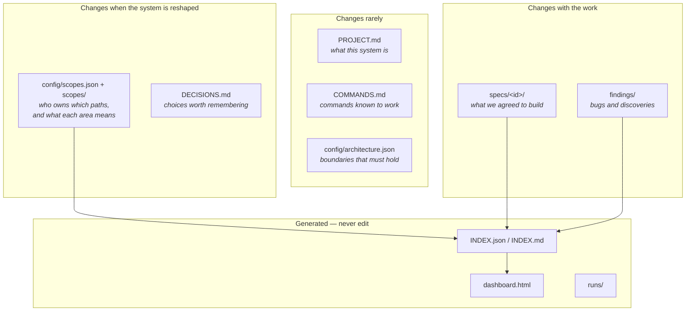

The split matters. When a fact is wrong, you should know immediately which file owns it.

### How they connect

This is the graph the CLI walks:

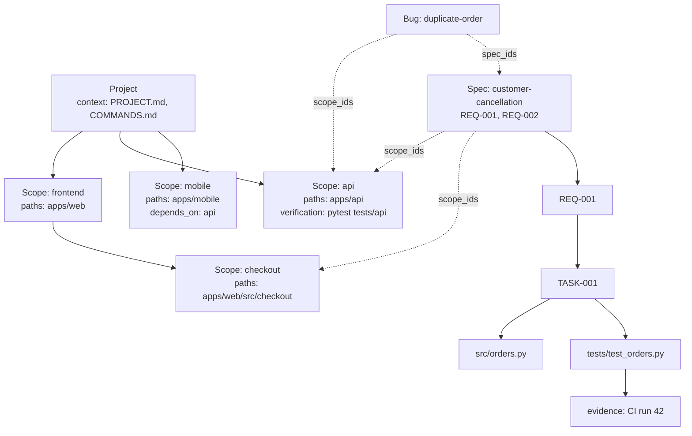

Two independent hierarchies meet at the scope:

- **Scopes** form a tree by *path ownership*. A nested scope inherits its parents' context.
- **Scopes** also form a graph by `depends_on`. That graph is directed and drives impact analysis.

A spec, a bug, or a discovery attaches to one or more scopes. Routing a path therefore yields everything relevant to that path in one call.

### What routing returns

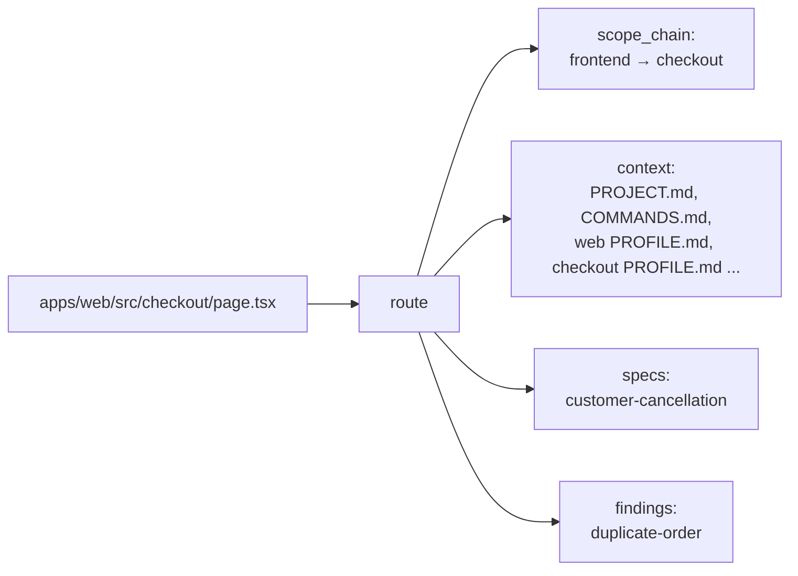

The scope chain is ordered from general to specific, and the most specific owning path wins. Context accumulates down the chain, so an agent working in `checkout` sees project facts, frontend facts, and checkout facts — and nothing about `mobile`.

### What impact analysis returns

`impact` starts from the routed scopes and follows `depends_on` **backwards** — to everything that consumes what you changed.

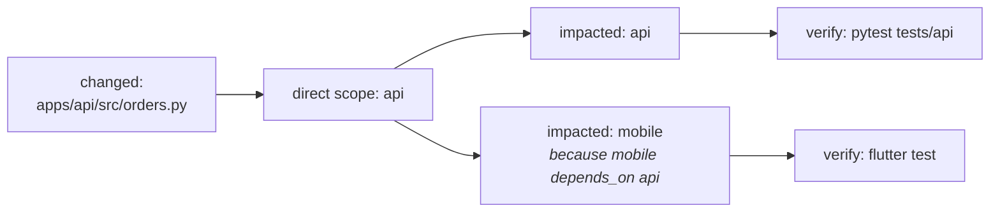

This is why scopes declare their own verification commands: the tool can tell you *what to re-run* without knowing anything about your build system.

---

## 5. The daily loop

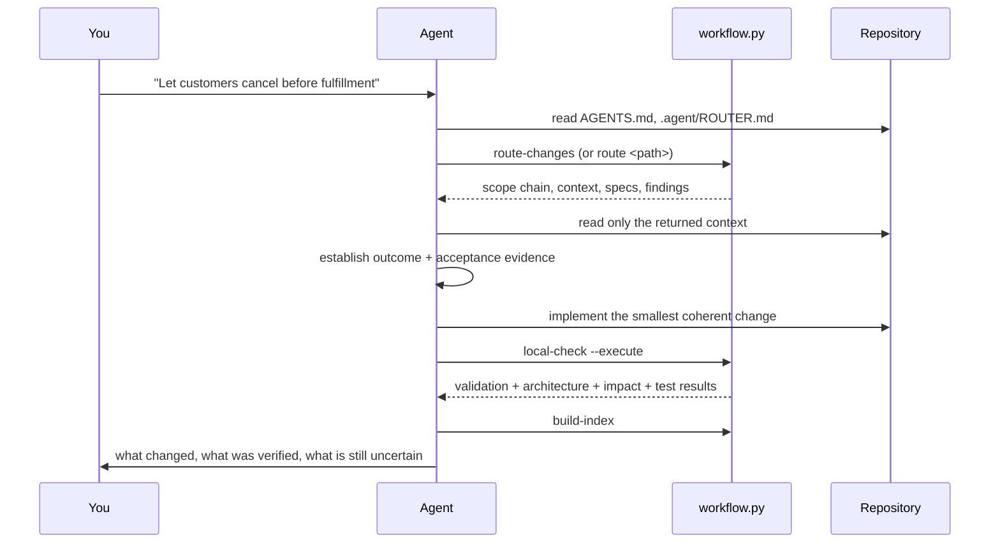

In practice you type a normal request. The agent does the rest because `AGENTS.md` tells it to. The CLI is what makes that instruction checkable rather than aspirational.

---

## 6. Concepts

### Scope

A named area of the repository that owns paths and meaning. Two kinds:

- `application` — a deployable or buildable unit (`apps/web`, `apps/api`)
- `business` — a capability inside one (`checkout`, `billing`)

Each scope gets four documents it owns: `PROFILE.md` (what this area is for, its rules, its vocabulary), `STATE.md` (current variables, assumptions, open questions), `DECISIONS.md`, and `CHANGES.md`.

Rules enforced by `validate`:

- One path has exactly one owner.
- Overlapping paths require a declared parent/child relationship.
- The hierarchy has no cycles.
- Every referenced context file exists.

```shell
python .agent/workflow.py create-scope api --title "Public API" --kind application \
  --path apps/api --verify "tests=python -m pytest tests/api"
python .agent/workflow.py create-scope checkout --title "Checkout" --kind business \
  --path apps/web/src/checkout --parent frontend
```

### Spec

One directory per feature, holding what was agreed:

| File | Owner | Purpose |
|---|---|---|
| `spec.json` | you | machine-readable requirements, status, approvals |
| `spec.md` | you | the human narrative |
| `plan.md` | generated | requirement coverage and impact |
| `tasks.md` | generated | one task per requirement |
| `traceability.json` | you | requirement → task, code, test, evidence |

Requirements carry stable `REQ-NNN` ids. Plans and tasks embed a digest of the requirements they were generated from, so editing `spec.json` without regenerating them is detected.

Large specs can split requirements across files under `requirements/`, declared in `requirement_files`. Ids stay unique across the whole bundle, and every command — planning, tasks, validation, reporting — aggregates all of them.

### Assumptions and open decisions

A spec carries two fields that record what you do *not* know. They are checked when the spec is accepted, because an accepted spec is a commitment.

```json
{
  "assumptions": [
    {
      "statement": "The provider settles same day",
      "owner": "Payments team",
      "consequence": "Payout reporting is wrong and the cancellation window is too short"
    }
  ],
  "open_decisions": [
    {
      "question": "Do we refund shipping on cancellation?",
      "impact": "billing, customer communication",
      "resolution": "No. Decided 2026-09-01 by Product."
    }
  ]
}
```

At `Accepted`:

- Every assumption needs a statement, an **owner or a validation method**, and a **consequence if false**. An assumption nobody owns is a rumour.
- Every open decision needs a **resolution**. An unresolved decision means the spec is not an implementation target yet — record the resolution, or move the spec to `Blocked`.

Both lists may be empty. Record only uncertainty that could change scope, architecture, security, data, compatibility, cost, or user-visible behaviour.

The spec's own `scope.in` / `scope.out` are checked the same way: an accepted spec must say what it does *not* cover.

### Spec lifecycle

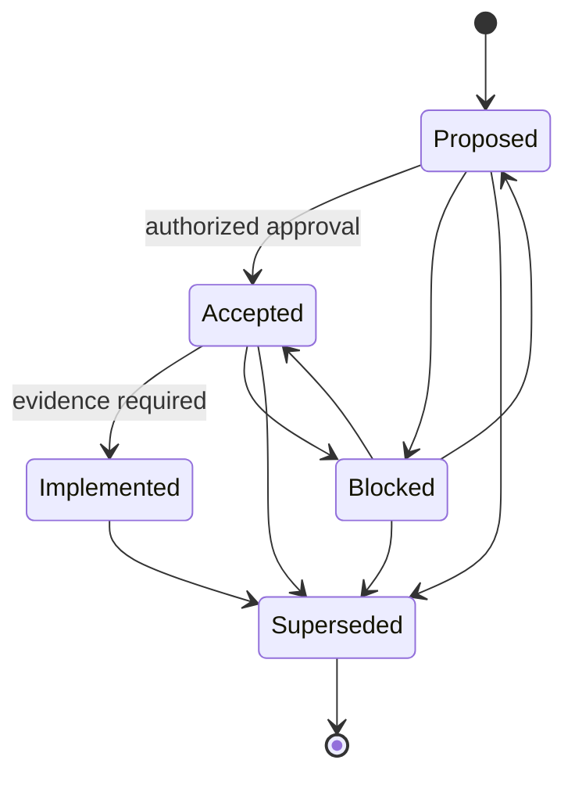

What each state means:

- **Proposed** — understood well enough to discuss. Placeholders are allowed. Drafts do not fail CI.
- **Accepted** — the current implementation target. Every requirement must have a real statement and real acceptance evidence.
- **Implemented** — acceptance evidence exists, and `traceability.json` links every requirement to a task, a file that exists, a test that exists, and evidence.
- **Blocked** — waiting on a decision or an authority. This is where a spec with an unresolved open decision belongs.
- **Superseded** — replaced; kept for history. Terminal.

Note there is no path back from `Implemented` except `Superseded`. If an implemented feature turns out wrong, that is a **bug** (a finding) or a **new spec** that supersedes it — not an edit to history.

Transitions are the only supported way to change status. Editing `approvals` by hand to imitate a stakeholder defeats the entire point.

### Finding — bugs and discoveries

A place to put things that would otherwise be lost in a chat log.

- **bug** — reproducible incorrect behaviour
- **discovery** — a durable fact, constraint, risk, or opportunity found while working ("the provider rate-limits at 100/min")

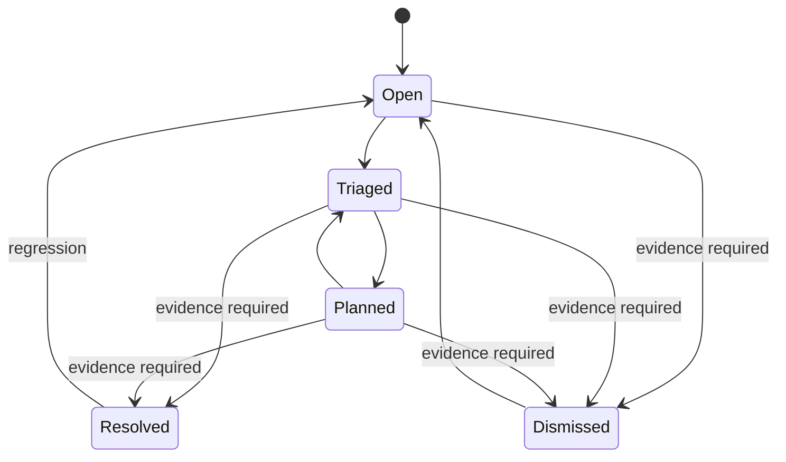

Findings link to scopes and specs, so they surface automatically when someone routes an affected path.

### Decision

`DECISIONS.md` is for choices whose *rationale* must outlive the conversation: a boundary between components, a public contract change, choosing a provider, accepting a temporary exception. Not for things the code already says clearly.

---

## 7. Walkthrough: one feature end to end

```shell
# 1. What context does this area carry?
python .agent/workflow.py route apps/api/src/orders.py

# 2. Record what we agreed to build
python .agent/workflow.py create-spec customer-cancellation \
  --title "Customer cancellation" --owner "Product" --scope api

# 3. Edit .agent/specs/customer-cancellation/spec.json:
#    give REQ-001 a real statement and real acceptance_evidence.
#    Then regenerate the execution artifacts.
python .agent/workflow.py generate-plan customer-cancellation
python .agent/workflow.py generate-tasks customer-cancellation

# 4. Get authorization. This fails if any requirement is still a placeholder.
python .agent/workflow.py transition customer-cancellation Accepted --actor "Product Owner"

# 5. Implement. Then check what your changes affect and verify it.
python .agent/workflow.py local-check --execute

# 6. Link each requirement to its task, code, test, and evidence.
#    Build it up as you go; it refuses task ids and files that do not exist.
python .agent/workflow.py link-requirement customer-cancellation REQ-001 \
  --task TASK-001 --code src/orders.py
python .agent/workflow.py link-requirement customer-cancellation REQ-001 \
  --test tests/test_orders.py --evidence "CI run 42"

python .agent/workflow.py transition customer-cancellation Implemented \
  --actor "Engineering" --evidence "CI run 42"

# 7. Refresh the index and the dashboard
python .agent/workflow.py build-index
python .agent/workflow.py dashboard
```

Requirements change mid-flight. When they do, classify the change and record it rather than quietly rewriting the target:

```shell
python .agent/workflow.py record-scope-change checkout \
  --summary "Cancellation boundary moved to fulfillment start" \
  --actor "Product" --classification replacement --impact api --impact mobile
```

Classifications: `clarification` (no behaviour change), `additive`, `replacement`, `reversal`.

---

## 8. Making other tools find it

`AGENTS.md` is the entry point, but not every agent tool reads it. Two optional commands wire the workflow into the surrounding tooling. Neither runs automatically at install; both are safe to re-run.

### Entry points for other agent tools

```shell
python .agent/workflow.py sync-entrypoints
```

Writes short pointer files that redirect to `AGENTS.md` — by default `CLAUDE.md`, `GEMINI.md`, `.github/copilot-instructions.md`, and `.cursor/rules/agent-workflow.mdc`. They contain no project facts, only a pointer, so there is nothing to keep in sync.

**An existing file is never overwritten.** If you already have a `CLAUDE.md`, it is left alone and `doctor` warns that it does not point at `AGENTS.md`, so a tool reading it would miss the workflow entirely. Change the list with `entry_points` in `.agent/config/workflow.json`.

### Keeping the index current

```shell
python .agent/workflow.py install-hooks
```

Installs a `pre-commit` hook that runs `build-index` and stages the result, so `INDEX.json` can never lag the sources it summarises — which is what `check-index` fails CI for. If routing is invalid the hook fails the commit instead of recording a broken state:

```
Routing is not valid:
broken: unknown parent does-not-exist
```

It refuses to replace a `pre-commit` hook it did not write; review that hook and re-run with `--force`, or chain them yourself.

---

## 9. Commands, grouped by intent

**Understand what I am touching**

| Command | Answers |
|---|---|
| `setup [--ask]` | Onboard this repository in one step |
| `bootstrap [--force] [--json]` | What does this repository already tell me about itself? |
| `adopt [--json]` | Write down everything that evidence proves, without touching what a person wrote |
| `route <path> [--intent <intent>] [--task <description>]` | Which scopes own this, which explicit or inferred task workflow applies, and what should I read? |
| `route-changes [--base <ref>]` | Same, for everything Git says changed |
| `impact <paths...>` | What downstream is affected, and what must I re-run? |
| `context-budget <path> --intent <intent>` | How much context will this route load, and should it be split? |
| `handoff show\|validate\|clear` | Inspect or close the transient state from an unfinished session |
| `agent-budget --agents N --concurrency N [--high-effort N]` | Check bulk-agent fan-out against project limits before execution |

**Reach one part of a long document**

| Command | Purpose |
|---|---|
| `outline <path>` | Section ids, titles, and line counts; says when the file is short enough to read whole |
| `read <path> --section <id>` | That section and its subsections, plus the document's table of contents |
| `find "<words>" [--path ...] [--limit N]` | Ranked section references, narrowest match first |

Nothing is indexed. The outline is derived from the file on every call, so a section reference cannot
go stale the way a stored line range would. `find` is deliberately lexical: it ranks by how many
query terms a section matched and how densely, and drops any section that contains another match, so
a 700-line chapter never outranks the 20-line answer inside it. Reads always carry the table of
contents, because the failure mode of narrow retrieval is not reading too little — it is not knowing
what was skipped.

**Execute a task too large for one session**

| Command | Purpose |
|---|---|
| `run start <spec> [--force]` | Seed the run from `tasks.md` |
| `run next <spec>` | Brief for exactly one task; start a fresh session on it |
| `run complete <spec> <task> --code ... [--test ...] [--evidence ...] [--handoff ...]` | Prove the declared files changed, verify the scope, then advance |
| `run report <spec>` | Failed attempts, retry cost, first-pass rate, replans, elapsed time |
| `run retry <spec> <task>` | Unblock a task after fixing what broke it |
| `run replan <spec>` | Adopt a rewritten `tasks.md` without losing finished work |
| `run status <spec>` | Task states, attempts, and whether the plan drifted |

The chain exists so each task gets a clean context instead of one context that accumulates every
earlier attempt. Three rules make it worth doing: a task must prove it changed the files it claims,
a failed task's output never reaches the next task, and the remaining plan can be rewritten whenever
the work teaches you something. A fixed plan decided
up front, executed without revision, is slower than not splitting at all.

**Record what we agreed**

| Command | Purpose |
|---|---|
| `create-spec <id> --title --owner [--scope]` | Start a feature spec |
| `add-requirement-set <spec> <set> --title` | Split a large spec by business area |
| `generate-plan <spec>` / `generate-tasks <spec>` | Refresh execution artifacts after editing requirements |
| `transition <spec> <state> --actor [--evidence]` | Move the lifecycle with an audit trail |
| `link-requirement <spec> <REQ-NNN> [--task] [--code] [--test] [--evidence]` | Add traceability for one requirement; merges with what is already linked |
| `sync-spec <spec>` | Rewrite `spec.md` metadata from `spec.json` |

**Record what we found**

| Command | Purpose |
|---|---|
| `create-finding bug\|discovery <id> --title --reporter --severity [--scope] [--spec]` | Capture it outside the chat |
| `transition-finding bug\|discovery <id> <state> --actor [--evidence]` | Move it forward |
| `record-scope-change <scope> --summary --actor --classification [--impact]` | Log a material business change |

**Describe the system**

| Command | Purpose |
|---|---|
| `create-scope <id> --title --kind --path [--parent] [--depends-on] [--verify]` | Declare an area and its verification |
| `build-index` | Rebuild `INDEX.json`, `INDEX.md`, and per-scope indexes |
| `sync-entrypoints` | Create pointer files for agent tools that do not read `AGENTS.md` |
| `install-hooks [--force]` | Install the pre-commit hook that keeps the index current |

**Check the work**

| Command | Checks |
|---|---|
| `validate` | Routing, specs, and findings are internally consistent |
| `check-architecture` | Declared module boundaries hold |
| `check-index` | The index matches its sources |
| `doctor` | All of the above, plus installation completeness and config sanity. Reports unfilled templates as warnings, not failures |
| `local-check [--base] [--execute]` | Everything, plus Git changes, impact, and optionally runs scope verification |
| `verify <paths...>` or `verify --changed` | Runs only the verification commands the impact analysis selected |

`validate`, `check-architecture`, and `doctor` accept `--json` so an agent can read the result instead of scraping text:

```shell
python .agent/workflow.py doctor --json
```

**Report**

| Command | Output |
|---|---|
| `report [--output file.json]` | Spec status and traceability coverage as JSON |
| `dashboard` | `.agent/dashboard.html` |
| `local-init` | Migrate, build index, build dashboard — run once after install |
| `migrate` | Upgrade artifact `schema_version` in place |

---

## 10. The gates, and what green means

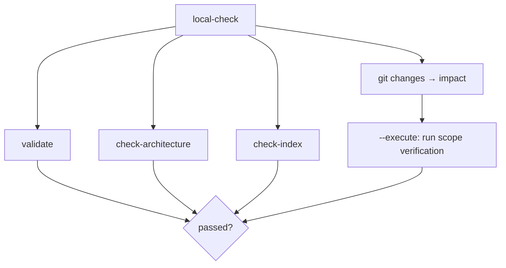

Read each result precisely:

| Gate | Green means | Green does **not** mean |
|---|---|---|
| `validate` | Specs, scopes, and findings are internally consistent | Requirements are good, or the code is correct |
| `check-architecture` | The declared module rules hold — the summary line states how many modules and files were inspected | Your architecture is sound. If it says *"No architecture rules configured"*, nothing was checked |
| `check-index` | The index matches scopes, specs, and findings | The index describes reality — it describes the config |
| `doctor` | The installation is structurally sound | Your project is described. Read its warnings: `PROJECT.md: 14 unfilled placeholder(s)` means the most valuable file in the system is still a template, and `CLAUDE.md exists but does not point at AGENTS.md` means a tool reading it never finds the workflow |
| `verify` | Your declared commands exited zero | Anything you did not declare was tested |

`check-architecture` always prints what it inspected. `Checked 4 module(s) across 812 source file(s); 0 violation(s)` is a real result. `No architecture rules configured` is not — it is a to-do.

### Architecture rules

Each module declares the path it owns, the import prefixes that identify it, and the modules it may depend on:

```json
{
  "schema_version": 1,
  "adapter_mode": "auto",
  "modules": [
    {
      "name": "orders-domain",
      "path": "src/Features/Orders/Domain",
      "import_prefixes": ["Features.Orders.Domain", "@features/orders/domain"],
      "may_depend_on": []
    },
    {
      "name": "orders-infrastructure",
      "path": "src/Features/Orders/Infrastructure",
      "import_prefixes": ["Features.Orders.Infrastructure", "@features/orders/infrastructure"],
      "may_depend_on": ["orders-domain"]
    }
  ]
}
```

Imports are read with per-language parsing — comments and docstrings are stripped first, and patterns are anchored to statement position — so a sentence like `// callers should use infrastructure adapters` is prose, not a dependency. Directories such as `node_modules`, `bin`, `obj`, `dist`, and `.venv` are skipped; override with `ignored_directories`. Set `"adapter_mode": "off"` to disable the .NET `ProjectReference` and `package.json` workspace adapters.

A module whose `path` does not exist is reported as a configuration error, because a rule that silently matches nothing is worse than no rule.

**Known limit:** prefix matching does not resolve `tsconfig.json` path aliases, bundler aliases, or build-time path mapping. Declare the prefixes that actually appear in source.

---

## 11. Sharp edges

**Generated files are generated.** `INDEX.json`, `INDEX.md`, per-scope `INDEX.md`, `plan.md`, and `tasks.md` are rewritten by the tool. Editing them by hand is lost work, and `check-index` or the requirements digest will flag it.

**The index is committed.** `check-index` runs in CI, so `INDEX.json` must be in the repository and current. Run `install-hooks` once and the pre-commit hook keeps it current for you; otherwise run `build-index` after any scope, spec, or finding change. On a busy repository this file is a predictable merge conflict — resolve it by rerunning `build-index`, never by hand-merging.

**Placeholders are allowed while `Proposed`, and only then.** A fresh spec passes `validate`. The moment you transition it to `Accepted`, every requirement needs a real statement and real acceptance evidence.

**Traceability is checked against the filesystem.** A link is complete only when its task id appears in `tasks.md` and every listed code and test path actually exists. Listing a file you have not written yet fails the transition.

**`route` on an unowned path still succeeds.** It returns project-level context with an empty `scope_chain`. Empty means "no scope claims this path" — which may mean you have not declared the scope yet.

**Scope verification runs through the shell.** `local-check --execute` and `verify` execute the commands in `.agent/config/scopes.json` with `shell=True`. That file is executable configuration: review changes to it the way you review a CI workflow, and do not run `--execute` on an untrusted branch.

**Traceability is a command, not a text edit.** Use `link-requirement`. It verifies the task id against `tasks.md` and every path against the filesystem before writing, so a link that exists is a link that holds. Hand-editing `traceability.json` bypasses that check until the `Implemented` transition catches it.

**Run the CLI from the repository root**, or pass `--project <path>`. It defaults to the current working directory.

**Upgrading.** `scripts/update_workflow.py <project> --migrate` replaces only `.agent/vendor/`, backs up the previous bundle under `.agent/backups/`, restores it if replacement fails, and tops up `.agent/.gitignore`. It never replaces your specs, scopes, findings, decisions, or configuration; with `--migrate` it only adds missing `schema_version` fields and any local runtime files you do not already have. The PowerShell installer's `-Force` is not an upgrade path.

---

## 12. Fitting it to your repository

The framework ships deliberately thin defaults. Make these yours:

1. **`.agent/PROJECT.md`** — the highest-value file. `setup --ask` fills what the repository proves and asks you the rest; leave unknowns marked unknown rather than inventing them.
2. **`.agent/COMMANDS.md`** — `adopt` fills declared commands; run each once before trusting it. A wrong command here is worse than an empty row.
3. **`.agent/ROUTER.md`** — project-specific path routing. Keep each route to the smallest set of references the task needs.
4. **`.agent/config/architecture.json`** — start with the two or three boundaries you actually care about, not a full taxonomy.
5. **Scopes** — declare them when the repo has more than one meaningful area, not before.
6. **Profiles** — `profiles/` holds only technology guidance that *changes a decision*. Do not restate the core workflow there.
7. **Entry points and hooks** — run `sync-entrypoints` if your team uses tools other than one that reads `AGENTS.md`, and `install-hooks` if `check-index` failures start showing up in CI.

Precedence when instructions conflict, from strongest:

1. Your current explicit request
2. Safety and authorization boundaries
3. Project-specific instructions and accepted requirements
4. Matching technology profiles
5. Universal workflow defaults

A higher-priority instruction never by itself authorizes destructive operations, production changes, or external communication.
