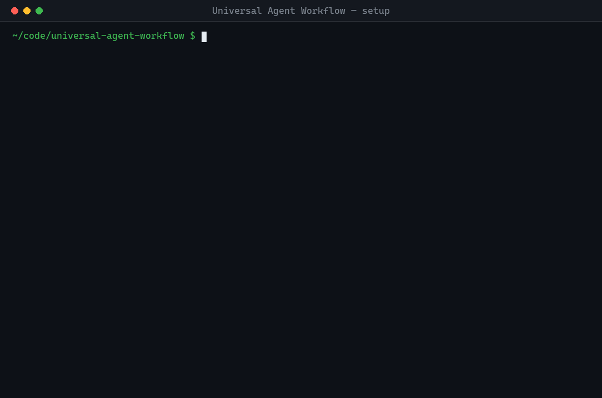
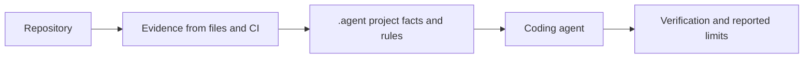

<div align="center">

# Universal Agent Workflow

**A technology-neutral workflow that gives coding agents repository-specific context and checks their work against project rules.**

[](VERSION)
[](#quick-start)
[](#quick-start)
[](LICENSE)

[Quick start](#quick-start) · [Full manual](MANUAL.md) · [الدليل العربي](GUIDE.ar.md)

</div>

Coding agents arrive without your project's history. They can guess a build command, miss an architectural boundary, or treat an old conversation as a current requirement. Universal Agent Workflow installs a project-owned `.agent/` directory and an `AGENTS.md` entry point so each agent can read relevant facts, follow the task workflow, and report what its checks actually established.

<div align="center">

</div>

## Quick start

Requires Python 3.9 or later. From a clone of **this repository**, run:

```shell
python scripts/install_workflow.py ../your-project
```

Then, from **your project**, run:

```shell
python .agent/workflow.py setup --ask
```

`setup` scans the repository, adopts evidence-backed facts and declared commands into `.agent/`, builds the local index, and creates agent entry-point pointers where needed. `--ask` prompts for facts the files cannot establish, such as purpose and users; press Enter to leave an answer open. Run each adopted command yourself before treating it as verified. Use `python3` if that is your local Python command. See [installation and onboarding](MANUAL.md#3-onboarding-how-the-agent-learns-the-project) for other shells, existing agent instructions, and greenfield projects.

### What changes for an agent?

| Before | After setup |
|---|---|
| “The tests are probably `npm test`.” | `.agent/COMMANDS.md` records a command declared by the repository, with its source. Someone runs it once before calling it verified. |
| “I should read the entire repository.” | Routing selects the context for the paths and task at hand. |
| “The tests passed, so the architecture is fine.” | Verification reports the commands run; an architecture check reports which configured boundaries it inspected. |

Then ask your coding agent for work normally, for example: “Allow customers to cancel an order before fulfillment begins.”

## What it provides

- **Evidence-based onboarding:** scans manifests, CI, documentation, and layout; each adopted fact cites its source. Convention-only guesses stay out of project facts.
- **Task and path routing:** gives an agent the relevant workflow, technology profile, and project context for the work.
- **Declared verification:** keeps project commands in one place and distinguishes a command found in a file from one actually run successfully.
- **Architecture checks:** tests configured module boundaries and states when no rules are configured or no files were checked.
- **Specs and traceability:** records approved requirements, decisions, tasks, code, tests, and evidence for changes that need an audit trail.
- **Change impact and task chains:** maps Git changes to affected scopes and supports bounded work across sessions.
- **Durable project memory:** keeps project facts, decisions, findings, and handoffs in the repository instead of relying on conversation history.

## Supported coding agents

The root `AGENTS.md` is the common entry point. `setup` runs `sync-entrypoints`, which creates short pointers for tools that use their own instruction files. It leaves existing pointer files alone.

| Agent | Entry point |
|---|---|
| OpenAI Codex | `AGENTS.md` |
| Claude Code | `CLAUDE.md` pointer (recommended) |
| GitHub Copilot | `.github/copilot-instructions.md` pointer |
| Cursor | `.cursor/rules/*.mdc` pointer |
| Gemini CLI | `GEMINI.md` pointer |
| Other agents | Point them to `AGENTS.md` |

You can select pointer targets in `.agent/config/workflow.json`. See [entry points in the manual](MANUAL.md#8-making-other-tools-find-it).

## How it works



The installed framework supplies task workflows and optional technology profiles. Your project owns `.agent/`: its purpose, commands, scopes, specs, decisions, and rules. The agent reads those files through `AGENTS.md`, routes the task, makes the change, and uses the project's declared checks. [The manual explains the layers and daily loop](MANUAL.md#4-the-mental-model).

## Safety and limits

- Onboarding reads files; it does not execute discovered commands or invent missing repository facts. `ci`, `declared`, `documented`, and `observed` describe where evidence came from, **not** a successful local run.
- `adopt` fills eligible `TODO` fields and preserves human-written values. Unknown facts can remain `unknown`.
- The installer refuses to replace an existing `AGENTS.md` or `.agent/`; pointer generation and the optional hook preserve existing files.
- A green check means only what it inspected. Empty architecture rules are reported as unconfigured; a passing command does not prove untested behavior.
- Scope verification commands execute through the shell when explicitly requested. Review those commands before running them. See [gates and sharp edges](MANUAL.md#10-the-gates-and-what-green-means).

## When to use it

Use it when agents work on a repository across sessions, when different areas need different context, or when decisions and verification need to survive the chat. Start with project facts and commands; add scopes, architecture rules, and specs as the work calls for them.

For a one-off script or a repository whose existing instructions already give an agent everything it needs, the setup may add more maintenance than value. The [manual's decision guide](MANUAL.md#2-when-to-use-it--and-when-not-to) discusses small projects, monorepos, and greenfield work.

## Go deeper

| Read | For |
|---|---|
| [User manual](MANUAL.md) | Concepts, setup scenarios, scopes, specs, lifecycle, architecture configuration, gates, task chains, and the [full command reference](MANUAL.md#9-commands-grouped-by-intent) |
| [الدليل العربي](GUIDE.ar.md) | Practical Arabic installation and daily-use guide |
| [Contributing](CONTRIBUTING.md) | Development and contribution instructions |

## Contributing and license

Contributions are welcome; see [CONTRIBUTING.md](CONTRIBUTING.md). Released under the [MIT License](LICENSE).
